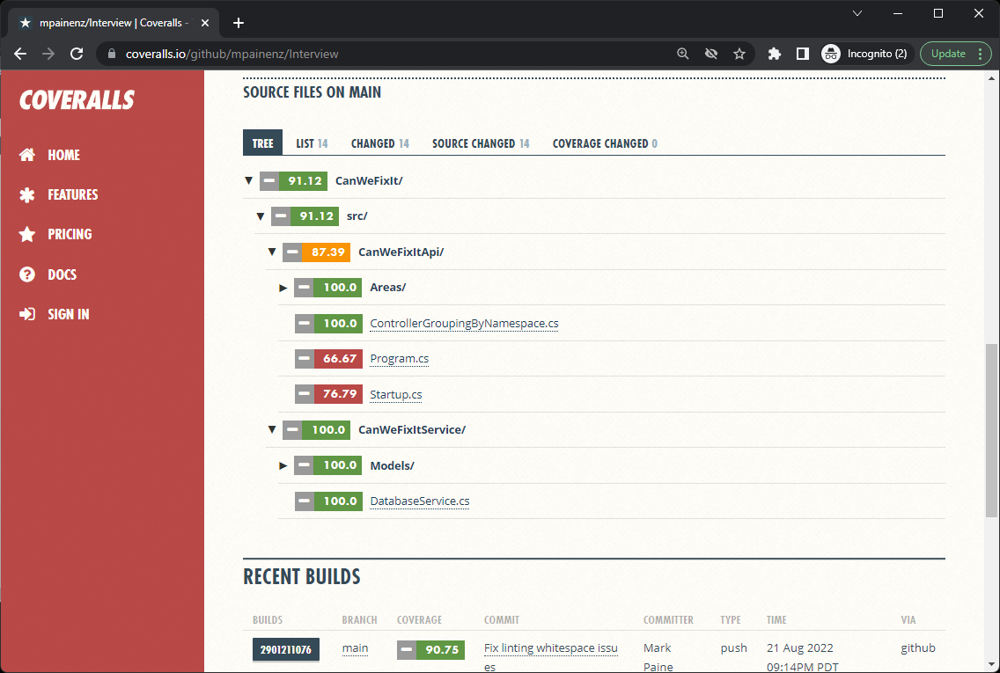

# AlphaCert Technical Screening

Mark Paine, 22/08/2022

## Continuous Integration

| Report      | Status |
| ----------- | ----------- |
| Latest Build      | [](https://github.com/mpainenz/Interview/actions/workflows/ci.yml)       |
| Linter  | [](https://github.com/marketplace/actions/super-linter)
| Test coverage  | [](https://coveralls.io/github/mpainenz/Interview?branch=main)        |


* Automated build and test CI pipeline via [GitHub actions](https://github.com/mpainenz/Interview/actions)
  - Cross platform test build coverage (Ubuntu, Windows, MacOS)

* Automated code linting via [GitHub super-linter](https://github.com/github/super-linter#codespaces-and-visual-studio-code)

* Automated test coverage reporting during CI via [Coverlet](https://dotnetfoundation.org/projects/coverlet) and [Coveralls](https://coveralls.io/)
  - Combined coverage report based on combined Unit and Integration test coverage reports

## Testing

* Unit testing against `CanWeFixItService` service layer project
  - Class fixture for Unit testing to improve performance (single shared instance of DatabaseService for all tests)

* Integration testing against `CanWeFixItAPI` project
  - Full coverage of REST API, including edge cases (404, or unknown http method types)

### Coverage reporting

<a href="https://coveralls.io/github/mpainenz/Interview"><a>

View test coverage reporting at [https://coveralls.io/github/mpainenz/Interview](https://coveralls.io/github/mpainenz/Interview)

## Project Structure and Design

* Semantic versioning of projects and project references
* Refactor API project directory structure to typical MVC layout, with src/test root directories
* API versioning, Separate V1 / V2 Controllers, and updated Swagger documentation with groupings

## Bugfixes

* In-Memory SQLLite Database is not thread safe
  - Added SemaphoreSlim to lock access to single thread during read
  - Previously the program would raise exceptions with <1000 concurrent tasks. Now runs 1 million (and beyond) tasks concurrently.

```csharp
        [Theory]
        [InlineData(1000)] // Crashes without semaphore
        [InlineData(1000000)]
        public async Task TestParrelelConnections(int taskCount)
        {
            var tasks = new Task[taskCount];
            for (int i = 0; i < taskCount; i++)
            {
                tasks[i] = Task.Run(async () => 
                {
                    await this._dbFixture.DBService.Instruments();
                }
                );
            }
            await Task.WhenAll(tasks);
        }
```

```csharp
        //Example semaphore usage
        public async Task<IEnumerable<Instrument>> Instruments()
        {
            await _semaphore.WaitAsync();
            try {
                return await _connection.QueryAsync<Instrument>("SELECT Id, Sedol, Name, Active FROM instrument WHERE Active = 1");
            } finally {
                _semaphore.Release();
            }
        }
```

* Fixed missing project references, using statements, and other compile errors
* Added missing fields returned by SQL querys
* Other minor fixes


## Other features

* Disabled stack traces/exception info for production HTTP error responses


## Other Considerations

* Database functions return potentially large datasets in current implementation
  - Consider implementing pagination/filtering/row count limitations for large datasets
  - Consider implementing caching for large datasets

* In-memory Database is transient
  - Consider implementing persistent database for production
  - Consider implementing in-memory caching for production

## Hypothetical Improvements

* A service such as Sentry could be used to capture Exception reports, and usage analytics
* Full Documentation of Swagger API endpoints
* Add versioning to Models
* Flesh out unit testing to include more specific test cases against known test data (mimick test `YesWeCan` project)

